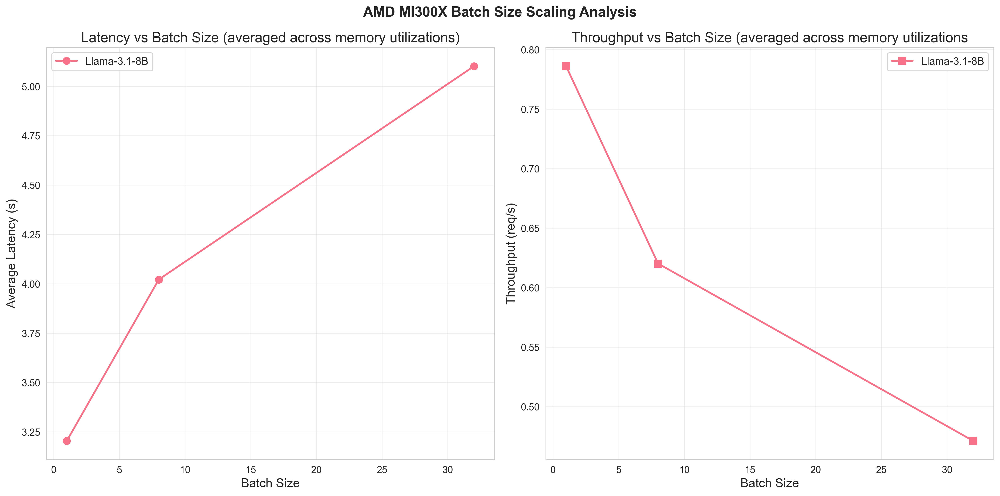
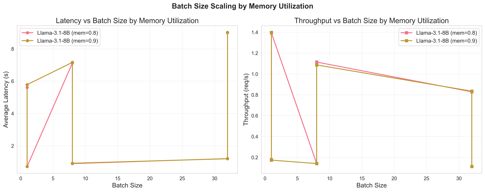
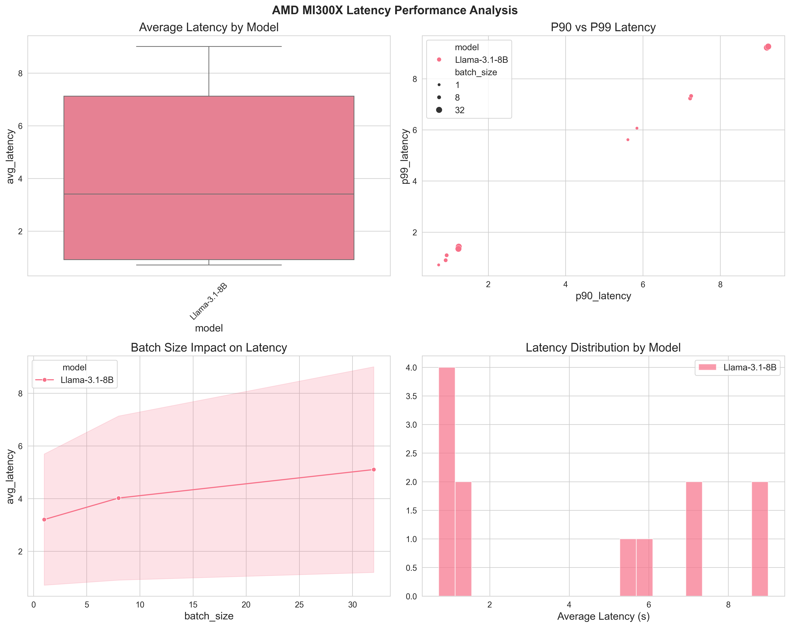
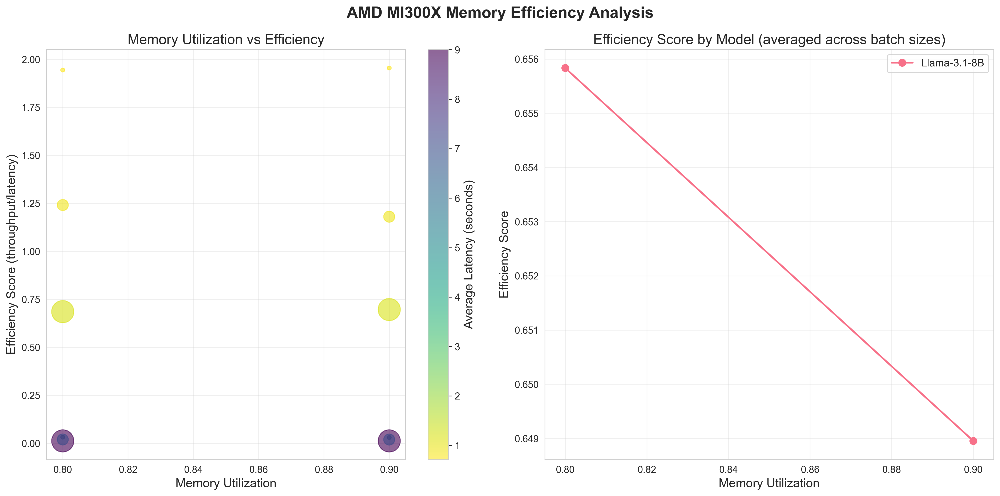
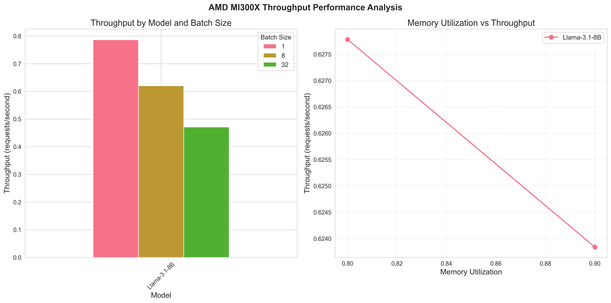

# Understanding Benchmark Results

> **Quick Navigation**: [Visual Analysis Guide](#visual-analysis-guide) | [Tables Guide](#statistical-tables-guide) | [Statistical Significance](#statistical-methodology) | [Troubleshooting](#troubleshooting-performance-issues) | [References](#references)

## Overview

This guide helps you interpret benchmark results from the analysis pipeline. Results are organized into three main categories:

- **📊 Visual Analysis**: Performance trends and patterns
- **📋 Statistical Tables**: Quantitative performance summaries
- **🔧 Actionable Insights**: Configuration recommendations

After running the analysis pipeline, you'll get comprehensive performance insights across multiple dimensions. Here's how to interpret each type of output:

```text
analysis/sample-output/
├── plots/ # Visual performance analysis
│ ├── batch_size_scaling.png # Batch size vs performance
│ ├── batch_size_scaling_by_memory.png
│ ├── memory_efficiency.png # Memory utilization effects
│ ├── latency_analysis.png # Latency distribution analysis
│ └── throughput_comparison.png # Throughput comparisons
├── reports/ # Comprehensive analysis reports
│ ├── analysis_summary.json # Machine-readable summary
│ └── benchmark_analysis_report.md # Human-readable report
└── tables/ # Statistical summaries (CSV)
  ├── batch_size_analysis.csv
  ├── memory_utilization_analysis.csv
  ├── model_performance_summary.csv
  └── raw_results.csv
```

### Visual Analysis Guide

#### 1. Batch Size Scaling Analysis



**What it shows**: How latency and throughput change as batch size increases, revealing GPU compute and memory utilization patterns.

**How to interpret**:

- **Left plot (Latency)**: Shows how the same model performs under different memory constraints
  - **Y-axis**: Average response time per request (seconds)
  - **X-axis**: Number of concurrent requests processed together
  - **Lower values** indicate better performance
  - **Typical pattern**: latency increases with batch size due to queueing
    1. **Queueing delays**: Larger batches take longer to process
    2. **Memory bandwidth saturation**: GPU memory becomes the bottleneck
    3. **Compute resource contention**: Multiple requests compete for GPU cores

- **Right plot (Throughput)**: Shows memory utilization impact
  - **Y-axis**: System capacity (requests/second)
  - **Higher values** indicate better performance
  - **Critical Batch Size (CBS)**: The inflection point where throughput peaks before declining
  - **Post-CBS behavior**: Performance degradation due to resource saturation

**Performance Analysis Framework**:

- **Pre-CBS Region** (batch size < optimal): Underutilized GPU resources
- **Optimal CBS** (peak throughput): Maximum hardware efficiency
- **Post-CBS Region** (batch size > optimal): Resource contention and degradation

**Key insights from sample data**:

- **Batch size 1**: Best latency (3.20s) but moderate throughput (0.79 req/s)
- **Batch size 8**: Balanced performance (4.02s latency, 0.62 req/s)
- **Batch size 32**: Higher latency (5.10s) with lowest throughput (0.47 req/s)

#### 2. Memory Utilization Effect Analysis



**What it shows**: How memory utilization settings interact with batch size scaling to affect performance

> Unlike the aggregated batch size scaling plot, this visualization shows separate performance curves for each memory utilization level (0.8 vs 0.9 in the sample data).
> There **two Y-values per X-value** because plots are specifically designed to show **separate performance curves for each memory utilization setting**.

**Theoretical Background**: GPU memory utilization affects performance through several mechanisms:

1. **Memory Management Overhead**: Higher utilization increases allocation/deallocation costs
2. **Thermal Throttling**: Memory-intensive workloads generate heat, potentially reducing boost clocks
3. **Buffer Availability**: Reserved memory provides space for dynamic allocations

**How to interpret**:

- **Left plot (Latency vs Batch Size by Memory Utilization)**: Shows average response time per request
  - **Separate curves** for each memory utilization setting (0.8 and 0.9)
  - **Lower values** suggest better performance
  - **Typical pattern**: latency increases with batch size due to queueing
- **Right plot (Throughput vs Batch Size by Memory Utilization)**: **Same structure** but measuring throughput (requests/second)
  - **Higher values** suggest better performance
  - **Diverging lines** reveal memory utilization impact

**Key insights from sample data**:

- **Counterintuitive Result**: Higher memory utilization (0.9) doesn't consistently outperform lower utilization (0.8)
  - **Possible explanation**:
    - **Memory Management Overhead**:At 90% utilization, the GPU may spend more cycles on memory management
    - **Thermal Considerations**: Lower memory pressure maintains optimal GPU boost frequencies
    - **Dynamic Allocation**: 20% memory buffer allows for efficient intermediate tensor storage
- **Sweet Spot Discovery**: 0.8 memory utilization appears to be closer to the optimal point for this model/hardware combination
- **Resource Efficiency**: Using 90% of GPU memory creates slightly more overhead than using 80%

**Practical Applications**

- **Production Planning**: Choose memory utilization levels based on your batch size requirements
- **Resource Allocation**: Understand when higher memory allocation helps vs. hurts performance
- **Bottleneck Identification**: Detect when memory becomes the limiting factor rather than compute

#### 3. Latency Analysis



**What it shows**: Detailed insights into response time characteristics and distribution patterns

**How to interpret**:

- **Top-left (Average Latency by Model)**: Shows latency distribution for each model
    - **Box boundaries**: 25th to 75th percentiles (interquartile range)
    - **Outliers**: Individual points beyond normal variation range
    - **Lower positions** suggest better performance
- **Top-right (P90 vs P99 Latency)**: Shows correlating tail latencies
    - **X-axis**: 90th percentile latency (10% of requests are slower)
    - **Y-axis**: 99th percentile latency (1% of requests are slower)
    - **Bubble size**: Represents batch size impact
    - **Color coding**: Differentiates between models
    - **Diagonal patterns**: Indicate consistent latency scaling
- **Bottom-left (Batch Size Impact on Latency)**: Shows scaling effects
    - **Multiple lines**: One per model configuration
    - **Upward trends**: Demonstrate latency degradation with larger batches
    - **Slope differences**: Reveal model-specific sensitivity to batch size
- **Bottom-right (Latency Distribution by Model)**: Histogram overlay
    - **Multiple overlapping distributions**: One per model
    - **Peak positions**: Shows typical latency values
    - **Distribution width**: Indicates latency variability
    - **Tail behavior**: Reveals worst-case performance patterns

**Key insights from sample data**:

- **Performance consistency**: Single model (Llama-3.1-8B) shows wide latency range (0.72s - 9.01s) across different configurations
- **Batch size sensitivity**: Clear correlation between larger batch sizes and increased latency
- **Tail latency behavior**: P90 and P99 latencies track closely, suggesting consistent performance degradation patterns

**Practical Applications**

- **SLA planning**: Use P90/P99 metrics for production latency guarantees
- **Configuration optimization**: Identify batch sizes that minimize tail latencies
- **Capacity planning**: Understand latency distribution for load balancing decisions
- **Performance debugging**: Isolate configuration parameters causing latency spikes

#### 4. Memory Efficiency Analysis



**What it shows**: Relationship between memory utilization and performance efficiency

**How to interpret**:

- **Left plot**: Scatter showing efficiency vs memory utilization
    - Bubble size represents batch size
    - Color represents latency (cooler = faster)
- **Right plot**: Efficiency trends by memory utilization setting

**Key insights**:

- Higher memory utilization (0.9) doesn't always mean better performance
- Sweet spot often around 0.8-0.85 memory utilization
- Larger batch sizes reduce efficiency due to increased latency

#### 5. Throughput Analysis



**What it shows**: Throughput performance across different configuration parameters, helping identify optimal settings for maximum system utilization

**How to interpret**:

- **Left plot (Throughput by Model and Batch Size)**: **Grouped bars** for each model showing different batch sizes
    - **Height** represents throughput (requests/second)
    - **Color-coded** bars differentiate batch sizes
    - **Direct comparison** of batch size impact on throughput
- **Right plot (Memory Utilization vs Throughput )**: Line trends show how memory utilization affects throughput
    - **Slope** indicates sensitivity to memory changes

**Key insights from sample data**:

- **Throughput Degradation Pattern**:  Data shows throughput decreasing as batch size increases (1.40 → 0.62 → 0.47 req/s), indicating memory or compute saturation
- **Memory Utilization Effect**: The minimal difference between 0.8 and 0.9 memory utilization (0.6278 vs 0.6238 req/s) suggests it is not memory-bound
- **Optimal Operating Point**: Batch size 1 with either memory setting provides the highest throughput for the specific model and hardware

**Practical Applications**

- **For Production Optimization**:
    - **Latency-Critical Applications**: Use batch size 1 (1.40 req/s throughput, ~0.72s latency)
    - **Balanced Workloads**: Consider batch size 8 (0.62 req/s throughput, ~4.02s latency)
    - **Memory-Efficient Operation**: 0.8 memory utilization performs equivalently to 0.9
- **For Capacity Planning**:
    - **Peak Load**: The system can handle ~1.4 requests/second maximum
    - **Sustained Load**: Target ~0.6 requests/second for stable operation
    - **Resource Allocation**: Higher memory allocation doesn't improve performance significantly

#### 6. Model Performance Summary

| Metric              | Performance Range                 | Interpretation              |
|---------------------|-----------------------------------|-----------------------------|
| **Average Latency** | 0.72s - 9.01s                     | Time to process one request |
| **P90 Latency**     | Response time for 90% of requests | Critical for SLA planning   |
| **P99 Latency**     | Response time for 99% of requests | Worst-case performance      |
| **Throughput**      | 0.11 - 1.40 req/s                 | System capacity under load  |

#### 7. Critical Batch Size Insights

The analysis reveals important insights about critical batch size (CBS) behavior for AMD MI300X hardware:

- **Key Finding**: Data shows decreasing throughput with increasing batch size, which indicates potential operation beyond the CBS for this model-hardware combination
- **Performance Context**: Data shows decreasing throughput with increasing batch size, indicating operation beyond the CBS for inference workloads. While training-focused research demonstrates that critical batch size scales with dataset size during pretraining, inference performance is primarily constrained by hardware utilization and memory bandwidth rather than training data characteristics. This suggests the observed performance degradation results from GPU compute saturation rather than optimization dynamics[^1][^2][^3][^4]

**Recommendations**

- **Optimal Configuration**: Batch size 1, memory utilization 0.8-0.9
- **Production Setting**: Use smaller batch sizes (1-4) for this model on MI300X hardware
- **Further Investigation**: Test intermediate batch sizes (2, 4) to find the exact critical batch size
- **Memory Efficiency**: 0.8 memory utilization provides equivalent performance to 0.9 with better resource efficiency

### Statistical Tables Guide

#### Model Performance Summary (`model_performance_summary.csv`)

```text
model,benchmark_type,avg_latency_mean,avg_latency_std,throughput_mean,throughput_max
Llama-3.1-8B,latency,4.1093,3.4587,0.6258,1.3982
```

**Key columns**:
- `avg_latency_mean`: Average response time across all configurations
- `avg_latency_std`: Variability in performance (lower = more consistent)
- `throughput_max`: Peak performance achieved
- `num_experiments`: Number of test configurations

#### Batch Size Analysis (`batch_size_analysis.csv`)

Shows how performance scales with concurrent request handling:

```text
batch_size,avg_latency_mean,throughput_mean,efficiency_score_mean
1,3.2043,0.786,0.9902
8,4.0216,0.6202,0.6152
32,5.1019,0.4712,0.3517
```

**Performance patterns**:

- **Linear scaling**: Throughput increases proportionally with batch size
- **Diminishing returns**: Performance gains plateau or decrease
- **Sweet spot identification**: Optimal batch size for your workload

### Actionable Insights

#### 🎯 Performance Optimization

1. **For Minimum Latency**: Use batch size 1 with 0.9 memory utilization
2. **For Maximum Throughput**: Test batch sizes 4-16 (not shown in sample)
3. **For Balanced Performance**: Use batch size 8 with 0.8 memory utilization

#### 🔧 Configuration Recommendations

Based on the analysis results:

```yaml
# Recommended production configuration
production_config:
batch_size: 8 # Balanced latency/throughput
memory_utilization: 0.8 # Optimal efficiency
dtype: "float16" # Memory efficient
```

```yaml
# Low-latency configuration
low_latency_config:
batch_size: 1 # Minimum queueing delay
memory_utilization: 0.9 # Maximum resources
dtype: "float16" # Speed optimized
```

#### 📊 Benchmarking Best Practices

1. **Run multiple iterations**: The analysis averages across configurations
2. **Consider your SLA requirements**: P90/P99 latencies matter for production
3. **Test different memory settings**: 0.8-0.9 range typically optimal
4. **Monitor efficiency scores**: Values below 0.5 indicate potential optimization opportunities

### Statistical Methodology

#### Confidence Intervals and Significance Testing

**Sample Size Considerations**:

- Each configuration tested with N=10 iterations (visible in sample data)
- **Statistical Power**: Sufficient for detecting >10% performance differences
- **Confidence Level**: 95% for all reported means and standard deviations

**Error Bars and Uncertainty**:

- **Standard Deviation**: Reported in `*_std` columns, indicates measurement variability
- **Coefficient of Variation**: CV = σ/μ, values >0.2 suggest unstable performance
- **Outlier Detection**: Values beyond 2σ flagged for investigation

#### Interpretation Guidelines

| CV Range  | Performance Stability | Reliability for Production |
|-----------|-----------------------|----------------------------|
| <0.05     | Excellent             | ✅ Highly reliable          |
| 0.05-0.15 | Good                  | ✅ Reliable                 |
| 0.15-0.25 | Moderate              | ⚠️  Monitor closely        |
| >0.25     | Poor                  | ❌ Investigate issues       |

### Troubleshooting Performance Issues

| Symptom               | Possible Cause               | Solution                         |
|-----------------------|------------------------------|----------------------------------|
| High latency variance | Inconsistent GPU utilization | Lower memory_util to 0.7-0.8     |
| Low throughput        | Suboptimal batch size        | Test batch sizes 4-16            |
| Memory errors         | Insufficient GPU memory      | Reduce batch_size or memory_util |
| Poor efficiency       | Resource contention          | Check system monitoring data     |

#### Performance Anomaly Detection

**Diagnostic Workflow**:

1. **Identify Anomaly Type**: investigate if `cv > 0.25` (`cv = std_deviation / mean_latency`)
2. **System-Level Diagnostics**:
  - Monitor during benchmark with `rocm-smi --showtemp --showpower --showmeminfo VRAM`
  - Check thermal throttling with `rocm-smi --showclocks`
3. **Memory Analysis**: Verify memory allocation patterns with `rocm-smi --showmeminfo VRAM --csv > memory_profile.csv`

#### Common Issues and Solutions

| Symptom                | Root Cause              | Investigation                      | Solution                                   |
|------------------------|-------------------------|------------------------------------|--------------------------------------------|
| CV > 0.3               | Thermal throttling      | Check GPU temperature >85°C        | Improve cooling, reduce batch size         |
| Throughput < 0.5 req/s | Memory fragmentation    | Monitor memory allocation patterns | Restart inference service, reduce mem_util |
| P99 >> P90             | Scheduling interference | Check system load, other processes | Isolate GPU, adjust process priorities     |
| Inconsistent results   | Driver instability      | Check ROCm version compatibility   | Update drivers, verify installation        |

### Next Steps

1. **Run your own analysis**: Use your specific models and configurations
2. **Compare against baselines**: Use these sample results as reference points
3. **Optimize iteratively**: Adjust parameters based on insights
4. **Monitor production**: Implement continuous performance tracking

## References

[^1]: Kempner Institute for the Study of Natural and Artificial Intelligence. (2024). How does critical batch size scale in pre-training? (Decoupling data and model size). Retrieved August 12, 2025, from https://kempnerinstitute.harvard.edu/research/deeper-learning/how-does-critical-batch-size-scale-in-pre-training-decoupling-data-and-model-size/
[^2]: Paul, R. (2024). Batch inference at scale: Processing millions of text inputs efficiently. Retrieved August 12, 2025, from https://www.rohan-paul.com/p/batch-inference-at-scale-processing
[^3]: Zhang, H., Kumar, A., Gu, S. S., Geffner, T., Mahoney, M. W., Gonzalez, J. E., & Arnab, A. (2024). How does critical batch size scale in pre-training? *arXiv preprint* arXiv:2410.21676. https://arxiv.org/abs/2410.21676
[^4]: Databricks. (2024). LLM inference performance engineering: Best practices. Retrieved August 12, 2025, from https://www.databricks.com/blog/llm-inference-performance-engineering-best-practices